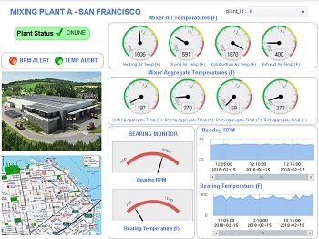

# RTView ClearBlade Project

## Overview
This project provides tools and examples that show how to use RTView Cloud with the ClearBlade Enterprise IoT Edge Platform to readily create and deploy rich graphical displays connected to real-time and historical ClearBlade data. 



By following the steps described below you will:
* Create an account on RTView Cloud
* Download and run on your local computer an RTView DataServer, providing real-time data caching and historical archival
* Run a Node.js connector program that subscribes to a few ClearBlade topics and populates the RTView DataServer
* Import into RTView Cloud sample displays, showing in real-time the data coming from ClearBlade

## Create an RTView Cloud account

* In a browser, go to [RTView Cloud](http://rtviewcloud.sl.com/).
* Click on Start Free Trial to create your account (skip if you have an account already).
* Login to your RTView Cloud account.

	Note that you are automatically in your own private organization (e.g. JohnSPrivateOrg).
	
## Download and run the RTView DataServer	

* From your RTView Cloud account, click on the ? icon at upper right to go to the Support page
* Select Downloads and elect to download the RTView DataServer to your computer
* Unzip the downloaded **RTViewDataServer_YYYYMMDD.zip** file to a directory of your choice
* Open a Command Window or Linux Shell in that directory

To start the RTView DataServer:
```
cd RTViewDataServer

start_server          (or ./start_server.sh in Linux)
```
At any time you can stop the server:
```
stop_server           (or ./stop_server.sh in Linux)
```
## Download and run the RTView-ClearBlade connector 

* Clone this RTView-ClearBlade project to your local computer.

*cd RTView-ClearBlade-Node*

*npm install*

	This will install the necessary node packages.

*node rtview_clearblade_feed*

	This will start the node script which subscribes to a few ClearBlade topics and pushes 
	the data into the RTView data server, which was set up in the previous section.


## Import and view the prebuilt RTView-ClearBlade displays

* In a browser, go to [RTViewCloud](http://rtviewcloud.sl.com/).
* On the top menu, click on Data.

	This will take you to the RTData Server List page in which you will create a connection 
	to the RTView data server that you previously started on your localhost.
	
* Click on the Add Server button.

* For Name, type:
CLEARBLADE-IOT-SERVER

* For Host/URL, type:
http://localhost:3270/rtvquery

* Click on Save Added Servers.
* To test the connection, click on the green magnifying glass next to the CLEARBLADE-IOT-SERVER.
	This will bring up the RTView DataServer - Cache Tables dialog.
	You should see "Connected" under Connection Status. 
	You should also see the ClearBladeCache in the CacheTable.
	
* Close the dialog.
* On the top menu, click on Design.

	This will bring up the RTDraw, which is RTViewCloud’s visual editor.
	
* Click on File in the menu.
* Click on Import ….
* In the file browser, change directory to RTView-ClearBlade-Displays.
* Select all displays and click Open.
* Click on File in the menu.
* Click on Open ….
* Double click on cb_mixing_plants.

	This will load the cb_mixing_plants display into the editor. 
	This display is configured to connect to your local RTView data server and collect data. This process then populates the display with live data that is being collected by the node script from ClearBlade.


## Achieved Goals
RTView-ClearBlade demo should have : 
* Shown how easy it is to display ClearBlade topics in graphical and highly configurable displays in the Cloud.
* Conveyed the structure of the node script, needed to send data to RTView, which subscribes to topics of interest.
* Allowed the users to enhance the existing RTView displays or create new ones.

**_Feel free to experiment with this project, modify it, enhance it and share your experience, comments, suggestions and/or enhancements with us._**

